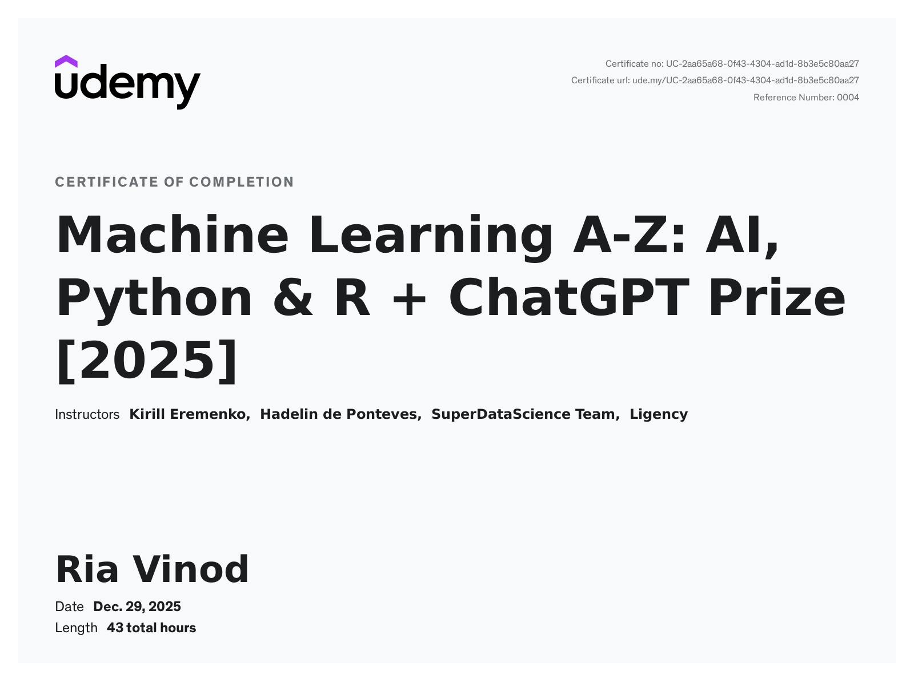

# Machine Learning A-Z

This repository contains my notes, practical implementations, and Jupyter notebooks completed while learning **Machine Learning** through the *Machine Learning A-Z: AI, Python & R + ChatGPT Prize [2025]* course.

The repository covers the complete machine learning workflow, from data preprocessing and regression to classification, clustering, dimensionality reduction, deep learning, model selection, and XGBoost.

---

## 📚 Topics Covered

### 1. Data Preprocessing

- Importing datasets
- Handling categorical data
- Label Encoding
- One-Hot Encoding
- Splitting datasets into training and test sets
- Feature Scaling

### 2. Regression

- Simple Linear Regression
- Multiple Linear Regression
- Polynomial Regression
- Support Vector Regression
- Decision Tree Regression
- Random Forest Regression

### 3. Classification

- Logistic Regression
- K-Nearest Neighbors (K-NN)
- Support Vector Machine (SVM)
- Kernel SVM
- Naive Bayes
- Decision Tree Classification
- Random Forest Classification

### 4. Clustering

- K-Means Clustering
- K-Means++
- Elbow Method
- Hierarchical Clustering

### 5. Association Rule Learning

- Apriori
- Eclat

### 6. Reinforcement Learning

- Upper Confidence Bound (UCB)
- Thompson Sampling

### 7. Natural Language Processing

- Bag of Words
- Sentiment Analysis
- Text Classification

### 8. Deep Learning

- Artificial Neural Networks (ANN)
- Convolutional Neural Networks (CNN)

### 9. Dimensionality Reduction

- Principal Component Analysis (PCA)
- Linear Discriminant Analysis (LDA)
- Kernel PCA

### 10. Model Selection & Boosting

- Bias-Variance Tradeoff
- K-Fold Cross-Validation
- Grid Search
- XGBoost

---

## 🛠️ Technologies & Libraries

- **Python**
- **NumPy**
- **Pandas**
- **Matplotlib**
- **Scikit-learn**
- **TensorFlow / Keras**
- **XGBoost**
- **Jupyter Notebook**
- **Google Colab**

---

## 📂 Repository Structure

```text
Machine-Learning-A-Z/
│
├── 000_Data_Preprocessing/
├── 001_Regression/
├── 002_Classification/
├── 003_Clustering/
├── 004_Association_Rule_Learning/
├── 005_Reinforcement_Learning/
├── 006_Natural_Language_Processing/
├── 007_Deep_Learning/
├── 008_Dimensionality_Reduction/
├── 009_Model_Selection_&_Boosting/
│
├── Certificate/
│   └── ml_cert_udemy.jpg
│
└── README.md
```

---

## 📊 Key Concepts Practiced

Throughout the course, I worked with:

- Data preprocessing and feature engineering
- Supervised and unsupervised learning
- Classification and regression
- Model evaluation using confusion matrices and accuracy
- Clustering techniques
- Association rule learning
- Reinforcement learning
- Natural language processing
- Neural networks and deep learning
- Dimensionality reduction
- Cross-validation
- Hyperparameter tuning
- Ensemble learning
- Gradient boosting

---

## 🏆 Course Certificate

Certificate of completion for the **Machine Learning A-Z** course.

<p align="center">
  
</p>

---

## 🎯 Learning Outcome

This course helped build a strong foundation in machine learning by combining theoretical concepts with practical implementations using Python and popular machine learning libraries.

The notebooks in this repository document the concepts, implementations, experiments, and results completed throughout the learning process.

---

## 👩‍💻 Author

**Ria Vinod**

---

⭐ This repository serves as a record of my Machine Learning learning journey and practical implementations.
